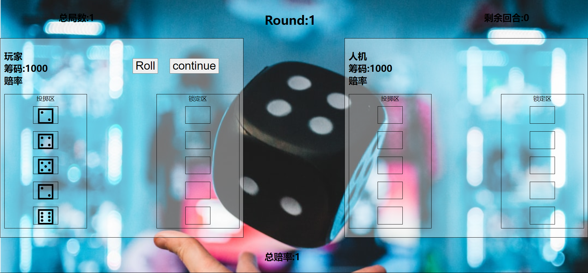
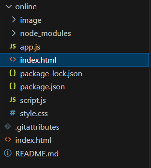
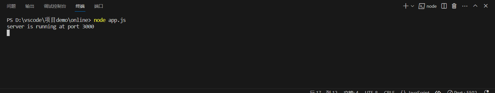

# roll_game

## 欢迎界面


## 对战流程（以人机对战为例）

### 0.大致玩法

进入游戏界面后，第一步，就先点击roll按钮，第二步，点击想要锁定的骰子，第三步，点击continue确认要锁定的骰子

### 1.先选择想要对战的局数


### 2.进入游戏桌面


玩家点击roll按钮，投掷区会随机生成骰子，同时continue按钮出现（用来确认锁定，将已锁定的骰子锁定到锁定区），玩家需要点击投掷区中想要锁定的骰子，把想要锁定的骰子都点击后，可点击continue继续



随后人机也会自动进行摇色子，在三秒后，可以进行倍率的选择


点击界面后就再回到了游戏界面，大致就是这样。本地对战的话，就是人机变成了玩家二，就相当于要操作两个玩家，操作流程还是一样

## 联机对战的注意事项（这个联机有点鸡肋，只是在本地运行，用来实现两个客户端的同步）

### 打开服务器

#### 首先找到并打开app.js文件




#### 然后要打开终端（这里以VScode的集成终端为例）

输入下面代码（注意终端路径）

```
node app.js
```



如果3000端口没被占用，你将在终端看到如上提示，如果被占用，可以使用vscode自带的快捷键ctrl+f，查询3000，然后把3000替换成空闲的端口号

### 打开客户端

在浏览器上输入'http://localhost:3000/'
即可打开一个客户端（也可以点击欢迎界面的联机对战来进行跳转），有两个客户端后，便可开始游戏

玩法也是基本一致，这里就不多赘述，由于时间有限，联机只在本地部署且只实现了简单的通信，让数据同步，即两个客户端的界面都一样（正常的游戏，对战双方客户端呈现的界面还是有差异的）

