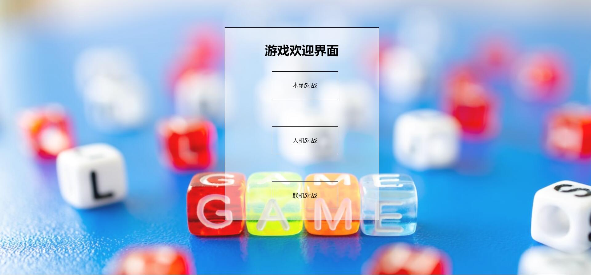

# roll_game

**b站视频链接:**https://b23.tv/utRdWUA

**项目相关技术栈:**前端使用**html+css+js**,后端使用的是**node.js**，联机对战使用的是**socket.io**


## 1.2 游戏规则

进入游戏，选择游戏模式后，设置游戏局数和玩家个人筹码数

每一局游戏内有三轮投掷机会，玩家一人一次轮流投掷骰子，每个玩家有5个骰子

前两次投掷骰子之后可以选择锁定0~5个骰子，锁定的骰子位于选定区域不再改变

前两轮每轮投掷结束并在所有玩家锁定骰子后，每位玩家可以选择增加倍率：0，1，2，3。选择完成后进入下一轮。

第三轮投掷结束后，所有玩家的全部骰子自动锁定并进行计分（得分为五个骰子的点数总和+奖励分），得出最终结果，筹码划分。

## 1.3 奖励分示例

- 双对 ：10分


- 三连 ：10分


- 葫芦：20分


- 四连： 40分


- 五连 ：100分


- 小顺子：30分


- 大顺子：60分


## 1.4 结算规则

分数最高的玩家从所有其它玩家手里赢得（二人分差的绝对值）*（总倍率）的筹码。

N局游戏后，筹码最多的玩家获胜。

如若中途有玩家筹码小于等于0，则该玩家被击飞，游戏直接结束（都没了的意思哦）。


## 欢迎界面



## 对战流程（以人机对战为例）

### 0.大致玩法

进入游戏界面后，第一步，就先点击roll按钮，第二步，点击想要锁定的骰子，第三步，点击continue确认要锁定的骰子

### 1.先选择想要对战的局数


### 2.进入游戏桌面


玩家点击roll按钮，投掷区会随机生成骰子，同时continue按钮出现（用来确认锁定，将已锁定的骰子锁定到锁定区），玩家需要点击投掷区中想要锁定的骰子，把想要锁定的骰子都点击后，可点击continue继续


随后人机也会自动进行摇色子，在三秒后，可以进行倍率的选择


点击界面后就再回到了游戏界面，大致就是这样。本地对战的话，就是人机变成了玩家二，就相当于要操作两个玩家，操作流程还是一样

## 联机对战的注意事项（这个联机有点鸡肋，只是在本地运行，用来实现两个客户端的同步）

### 打开服务器

#### 首先找到并打开app.js文件


#### 然后要打开终端（这里以VScode的集成终端为例）

输入下面代码（注意终端路径）

```
node app.js
```


如果3000端口没被占用，你将在终端看到如上提示，如果被占用，可以使用vscode自带的快捷键ctrl+f，查询3000，然后把3000替换成空闲的端口号

### 打开客户端

在浏览器上输入'http://localhost:3000/'
即可打开一个客户端（也可以点击欢迎界面的联机对战来进行跳转），有两个客户端后，便可开始游戏

玩法也是基本一致，这里就不多赘述，由于时间有限，联机只在本地部署且只实现了简单的通信，让数据同步，即两个客户端的界面都一样（正常的游戏，对战双方客户端呈现的界面还是有差异的）


----------------------------------------------2024/5/23--------------------------------

项目优化方向：用canvas标签和three.js给骰子添加一些动画，联机方面让网络同步，把参加游戏的客户端拉到一个房间内，采用广播的方式更新用户操作